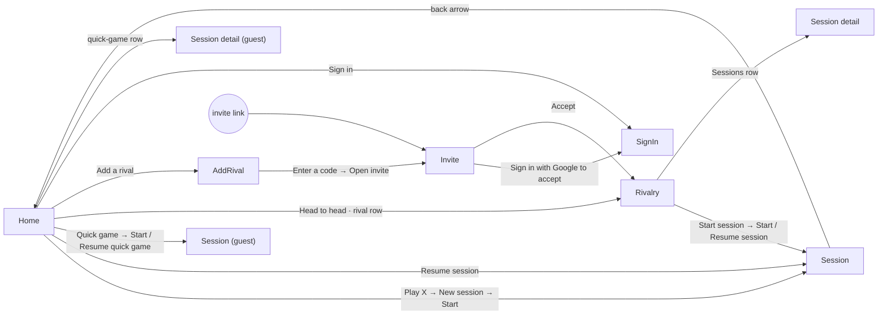

# Flow map

How Rivals is put together as a thing to use: every route, every way in and out of it, and
every action on every screen. Built for UX phase 1 (`design/ux-plan.md`) from
`ui/navigation` and the screens as of `da2e884`. Nothing here is a judgement; that's phase 2.
UX phase 4 keeps it current as the flow changes.

- **Renders** of every state named below are in `design/audit/renders/` as `<name>-dark.png` /
  `<name>-light.png`. On the landscape board, an open menu is composited onto the board where a
  landscape window would put it; a dialog over the board is shot on its own.
- **The real sequence** of a night, on the phone, is in `design/audit/walkthrough/`.
- **Jobs** are the numbered list in the plan's Context of use: 1 record a frame, 2 undo,
  3 tag a frame, 4 end/start a match or change game, 5 end the night, 6 start a night / glance
  at the head to head, 7 history and stats, 8 invite, sign in, quick game.
- **Taps** count from the running scoreboard, confirmations included, so the numbers compare
  with job 1 (one tap). "—" means it isn't reachable from a night without leaving it.

## Routes

| Route | Ways in | Ways out | System back |
|---|---|---|---|
| **Home** (`HomeRoute`, start) | Launch; back from anything; the board's back arrow; sign-out from a rival's screen | Every route below | Leaves the app |
| **Sign in** (`SignInRoute`) | Home top bar *Sign in*; Home signed-out *Sign in with Google*; Invite *Sign in with Google to accept* | Signed in → pops back where it came from; back arrow | Pops back |
| **Add a rival** (`AddRivalRoute`) | Home *Add a rival* (row, or the primary button with no rivals) | *Open invite* → Invite; share sheet (leaves the app); back arrow | Pops back |
| **Invite** (`InviteRoute`) | Share link `rivals-15bd9.web.app/invite/{code}` (deep link); Add a rival → *Enter a code* | *Accept* → Rivalry, with the stack reset to Home → Rivalry; *Sign in…* → Sign in; back arrow → pops, or Home when opened cold from the link | Same as the back arrow |
| **Rivalry** (`RivalryRoute`) | Home *Head to head* (hero), another rival's row; Invite *Accept* | Session; Session detail; *Remove rival* → Home (the screen leaves when the rivalry is gone, here or on the other phone); back arrow | Pops back |
| **Session** (`SessionRoute`) | Home *Play X* / *Resume session* / *Quick game* / *Resume quick game*; Rivalry *Start session* / *Resume session* | Back arrow → **Home** (pops everything above it); ending the session → pops back one (Home or Rivalry); the other phone ending it → same | Pops back one: Home, or **Rivalry** if started there — not the same place as the back arrow |
| **Session detail** (`SessionDetailRoute`) | Rivalry Sessions row; Home quick-game row (guest) | Back arrow; *Delete session* → pops back | Pops back |

Signing out while on a rival's screen (Rivalry, Add a rival, a rivals' Session or its detail)
pops to Home; a guest game carries on.

## Home

The only screen with more than one job on it. Its shape changes with who's signed in and
what's going on; renders: `home`, `home-idle`, `home-live`, `home-invites`,
`home-two-rivals`, `home-no-rivals`, `home-guest` / `home-signed-out`,
`home-signed-out-quick-game-running`, `home-quick-game-running`, `home-guest-games-all`,
`home-loading`, `home-message`.

| Action | Where it lives | Taps from the board | Job |
|---|---|---|---|
| **Resume session** (a night is running) | Primary button under the hero | 1 back + 1 = 2 | 6 |
| **Play *Julian*** → New session dialog → *Start* | Primary button → dialog (`home-new-session`): game (optional), race, venue, recent venues | — | 6 |
| *Head to head* → Rivalry | Text action beside "All time" (hero) | 2 | 7 |
| Glance at the head to head, form bar, tonight's score | On screen (hero) | 1 | 6 |
| Open another rival | Row in **Rivals** (says who leads, or "Playing now") | 2 | 7 |
| Accept / Decline an incoming invite | Buttons on the invite row in **Rivals**; no confirmation either way | — | 8 |
| Cancel an outgoing invite | Text action on the pending row; no confirmation | — | 8 |
| *Add a rival* | Row at the end of **Rivals**; the primary button when there are none | — | 8 |
| *Quick game* → dialog (names, game, race) → *Start* | Row in **Play** (`home-quick-game`); primary button when signed out | — | 8 |
| *Resume quick game* | Replaces the Quick game row / button while one runs | — | 8 |
| Open a finished quick game | Row in **On this phone** → Session detail (guest) | — | 7 |
| *Save* a quick game to a rivalry → dialog (which side was you, against whom) | Button on each quick-game row, signed in with a rival (`home-save-game`) | — | 8 |
| *See all N* / *Show fewer* quick games | Text action beside **On this phone** (more than three) | — | 7 |
| *Sign out* | Overflow menu, top bar (`home-menu`); its only item; no confirmation | — | 8 |
| *Sign in* | Top bar text action; *Sign in with Google* below the fold when signed out | — | 8 |
| Pending-sync cloud | Icon in the top bar (`home-live`) | — | feedback |

## Rivalry

Renders: `rivalry`, `rivalry-stats`, `rivalry-live`, `rivalry-empty`, `rivalry-not-accepted`,
`rivalry-starting`, `rivalry-loading`, `rivalry-error`.

| Action | Where it lives | Taps from the board | Job |
|---|---|---|---|
| **Start session** → New session dialog → *Start* | Primary button (`rivalry-new-session`); disabled until the invite's accepted | — | 6 |
| **Resume session** | Replaces Start, with tonight's score above it (`rivalry-live`) | 3 (back, Head to head, Resume) | 6 |
| Glance: win ring, all-time score, streak line | On screen | 2 | 6, 7 |
| *Sessions* / *Stats* tabs | Tabs under the primary button | 2 / 3 | 7 |
| Open a past night | Row in Sessions → Session detail | 3 | 7 |
| *Remove rival* → confirm | Overflow menu (`rivalry-menu`), its only item, in amber → dialog (`rivalry-remove`) | — | 8 |
| Back | Top bar arrow | — | — |

## Session (the scoreboard)

Landscape, status bar hidden, screen kept on. Three states: the board with a match running,
the match-won panel over the dimmed board, and the between-matches panel (only after a match
is ended by hand). UX phase 4 rebuilt it on "where actions live" (`design/brief.md`): the last
frame's receipt, the match sheet and the match-won panel replaced the ≡ dropdown. Renders:
`session`, `session-board`, `session-first-frame`, `session-hill-hill`, `session-open-ended`,
`session-quick-game`, `session-pending`, `session-loading`, `session-won`, `session-next`, and
the phase 4 states named below.

### On the board

| Action | Where it lives | Taps | Job |
|---|---|---|---|
| **Record a frame** | Tap the player's half; a haptic, and the score rolls | 1 | 1 |
| See the last frame | Its receipt on the status line: "FRAME 6 · KEVIN", "· THEIR PHONE" when the other phone recorded it, and its tags (`session-receipt-their-phone`, `session-receipt-tagged`) | 0 | 1, 2 |
| **Undo the last frame** | Round button beside the receipt; one tap, unconfirmed. Both phones then show "KEVIN UNDID FRAME 6 · 4 – 2 → 3 – 2" in the receipt's place for 4 s (`session-undone`) | 1 | 2 |
| Catch a double frame | Two frames from different phones within 10 s turn the receipt amber: "FRAMES 2 & 3 · 3 S APART" (`session-double`) | 0 | 2 |
| **Tag the last frame** | Tap the receipt → *Break & run*, *Golden break*, *Won on three fouls* above it; a chosen tag wears the winner's colour; a tap off them closes them (`session-tags`) | 2 | 3 |
| Back to Home | Arrow, left end of the status line (session keeps running) | 1 | 6 |
| Read the clock, match, game, race, tonight's score | Status line: the match at 14 sp in `fg-2`, tonight's score in white numbers | 0 | 1, 4 |
| Pending-sync cloud | Status line, after the clock (`session-pending`) | 0 | feedback |
| "On the hill" | Chip under a player's pips at race − 1 | 0 | 1 |
| Messages ("Couldn't save…", "Match 4 ended · no winner") | In the receipt's place on the status line, amber for errors, 4–6 s (`session-message`, `session-next-notice`) | 0 | feedback |

### The match sheet (≡, right end of the status line)

≡ dims the board and raises a sheet above the status line (`session-sheet`,
`session-sheet-new-match`, `session-sheet-open-ended`). A tap on the dimmed board closes it.

| Item | Shown when | Taps | Job |
|---|---|---|---|
| "Match 4", the score and minutes played | Always | 1 | 4 |
| Game chips, race stepper and *Open-ended*: change the running match at once, on both phones. The race can't go below the leader's score + 1 | Always | 2 | 4 |
| *End match* → confirm (`session-end-match`, `session-end-match-open-ended`) | The running match has frames | 3 | 4 |
| *End session* → confirm (`session-end-session`, `session-end-session-empty`), set apart | Always | 3 | 5 |

- *End match*'s confirm says what the match will count as: with a race, "won't count for
  either of you"; open-ended, the leader wins it, or level counts for nobody.
- *End session*'s confirm gives the final score and, with frames in the running match, what
  happens to it; with nothing played, it says the session will be deleted.

### Match won (`session-won`, `session-won-tagged`, `session-won-change`)

A race is reached → the next match starts automatically with the same settings; the board dims
and a panel says "Kevin takes it 5 – 2" and "Match 5 starts now. Tonight 3 – 1.", on both
phones, with a heavier haptic.

| Action | Where it lives | Taps | Job |
|---|---|---|---|
| *Play on* | Primary button in the panel | 1 | 1 |
| Tap anywhere on the dimmed board | Same as Play on, until the panel has been touched | 1 | 1 |
| *Undo* | Secondary button in the panel: takes the winning frame back and reopens the match | 1 | 2 |
| Tag the winning frame | "Tag the winning frame" chips in the panel | 1 | 3 |
| Change the next match's game or race | "NEXT · 9-ball · race to 5 · *Change*" → the chips and stepper, applied to the match already running | 2+ | 4 |
| Wait | The panel clears itself after 9 s, unless it's been touched: then it waits for *Play on* | 0 | — |

### Between matches (`session-next`)

Only after *End match* by hand. Two columns: tonight's score; "Next match" with the settings
picker. The status line stays, with back, notices and ≡.

| Action | Where it lives | Taps (from here) | Job |
|---|---|---|---|
| **Start match** | Primary button, with the game and race picker above it | 1 + adjustments | 4 |
| *Undo last frame* | Text action under it (reopens the ended match) | 1 | 2 |
| *End session* → confirm (`session-next-end-session`) | ≡ on the status line | 2 | 5 |
| Back to Home | Arrow on the status line | 1 | 6 |

### Leaving the session

- *End session* (menu, or the between-matches panel) → confirm → the session ends on both
  phones and each pops back one screen (Home or Rivalry). A session with nothing played is
  deleted rather than kept.
- The back arrow goes to Home and leaves the session running; Home and Rivalry then offer
  *Resume session*. System back pops one screen instead.
- Resuming re-shows the last match-won panel if nothing has been played in the new match yet,
  even after it was seen on this phone: "seen" isn't kept when the board is left
  (walkthrough, after 13).

## Session detail

Renders: `detail`, `detail-quick-game`, `detail-no-matches`, `detail-not-found`,
`detail-loading`, `detail-menu`, `detail-delete`.

| Action | Where it lives | Taps from the board | Job |
|---|---|---|---|
| Read the night: score, venue and times, highlights, each match's frames as boxed digits | On screen | 3 (back, Head to head, row) | 7 |
| *Delete session* → confirm | Overflow menu, its only item, amber (`detail-menu` → `detail-delete`); only for an ended session | — | 7 |
| Back | Top bar arrow | — | — |

A finished quick game opens here too; there's no *Save* on this screen (it's on Home's row).

## Add a rival

Three rows, one open at a time: renders `add-rival-closed`, `add-rival`/`add-rival-found`,
`add-rival-not-found`, `add-rival-invited`, `add-rival-link`, `add-rival-code`,
`add-rival-busy`. All job 8.

| Action | Where it lives |
|---|---|
| *Find by email* → type → *Find* (or the keyboard's search) → *Invite* on the result | First row, expands; result row with a secondary *Invite* |
| *Share a link* → *Share an invite link* → Android share sheet | Second row, expands |
| *Enter a code* → type → *Open invite* (or the keyboard's Go) → Invite | Third row, expands |
| Back | Top bar arrow |

## Invite

Renders `invite`/`invite-signed-out`, `invite-signed-in`, `invite-own`, `invite-gone`,
`invite-loading`, `invite-accepting`, `invite-error`. All job 8.

| Action | Where it lives |
|---|---|
| *Accept* (signed in) → Rivalry | Primary button, bottom |
| *Sign in with Google to accept* (signed out) → Sign in, then back here to Accept | Primary button, bottom |
| *Retry* | On the error state |
| Back | Top bar arrow |

## Sign in

Renders `sign-in`, `sign-in-busy`, `sign-in-error`. Job 8.

| Action | Where it lives |
|---|---|
| *Sign in with Google* → the system's account sheet | Primary button, bottom |
| Back | Top bar arrow |

## Dialogs and confirmations, in one place

| Dialog | From | Confirm | Destructive styling | Render |
|---|---|---|---|---|
| New session | Home *Play X*, Rivalry *Start session* | Start | — | `home-new-session`, `rivalry-new-session` |
| Quick game | Home | Start | — | `home-quick-game`, `quick-game`, `quick-game-chosen` |
| Save to a rivalry | Home quick-game row | Save | — | `home-save-game` |
| End this match? | Match sheet | End match | No | `session-end-match`, `session-end-match-open-ended` |
| End tonight's session? | Match sheet; ≡ between matches | End session | No | `session-end-session`, `session-end-session-empty`, `session-next-end-session` |
| Remove *Julian*? | Rivalry overflow | Remove | Amber | `rivalry-remove` |
| Delete this session? | Session detail overflow | Delete | Amber | `detail-delete` |

Not confirmed: undo (receipt, panel), every tag toggle, every change in the match sheet, sign out, decline or cancel an invite.

## Overflow menus

| Screen | Items |
|---|---|
| Home (⋮, signed in only) | Sign out |
| Rivalry (⋮) | Remove rival |
| Session detail (⋮, ended sessions only) | Delete session |
| Session (≡) | Not a menu since UX phase 4: the match sheet (above) |
